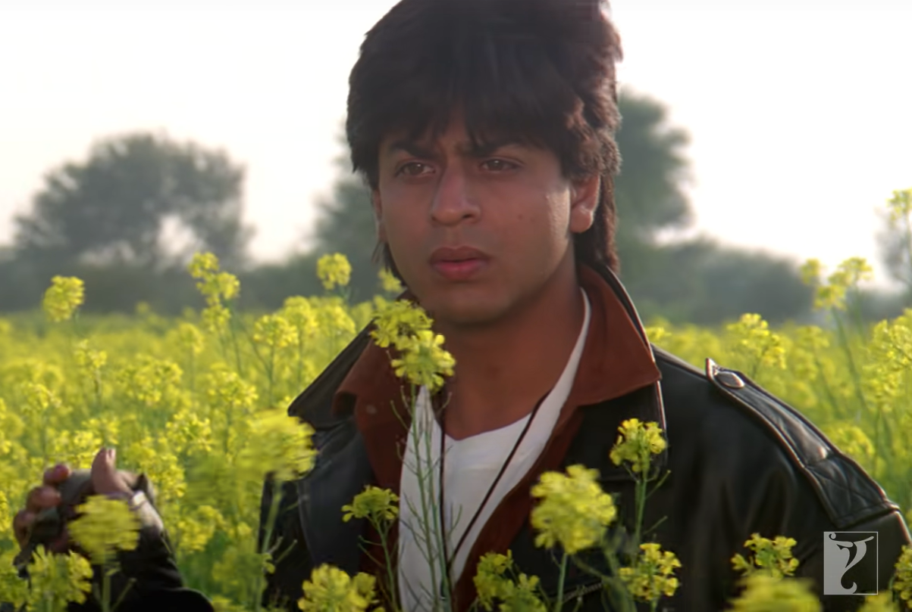
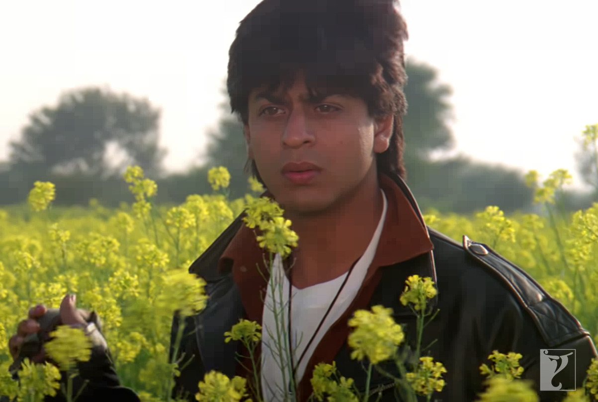
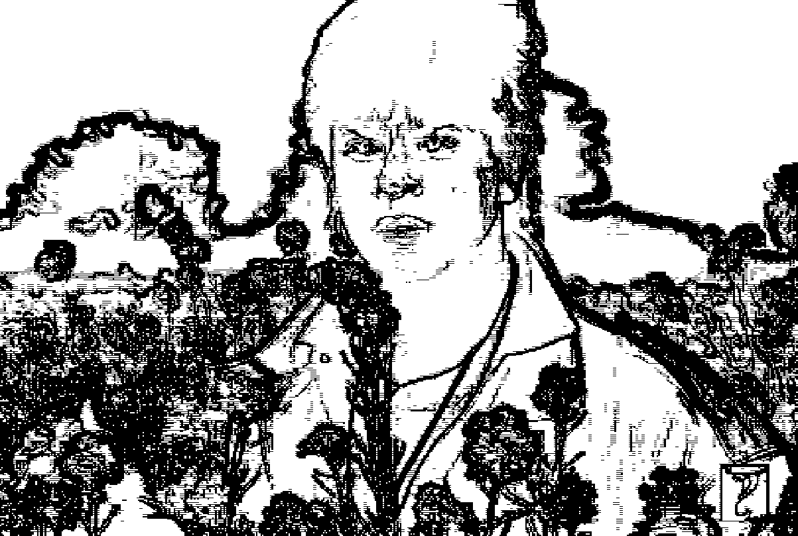
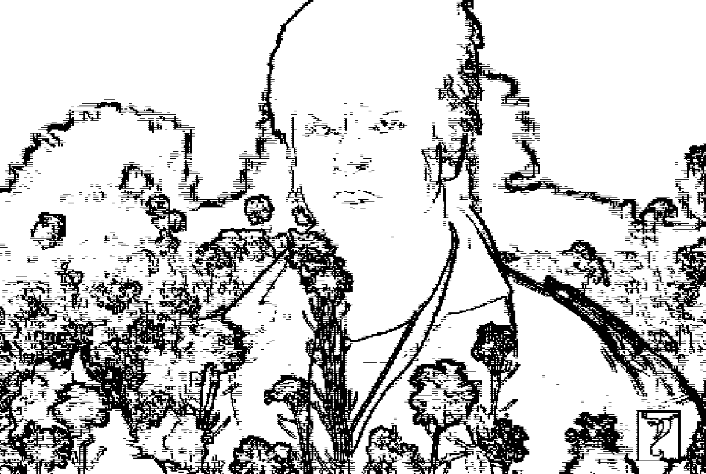

# Quadtree Image Compression & Edge Detection

A Python project implementing **quadtree-based image compression and edge detection**, designed for efficient image representation while preserving key visual details. This tool leverages recursive quadtree decomposition to compress images based on color similarity and variance, and performs edge detection with adjustable sensitivity.

---

## Features
- **Quadtree-based image compression**: Groups image regions with similar colors for reduced detail while maintaining structure.
- **Edge detection**: Highlights prominent edges based on color differences and pixel variance.
- **Adjustable tolerances**: Fine-tune compression and edge detection sensitivity with user-defined parameters.
- **Visualization**: Displays original, compressed, and edge-detected images.

---

## Tech Stack
- Python
- OpenCV
- NumPy
  
---

## Getting Started

### Prerequisites
Make sure you have the following installed:
```bash
pip install opencv-python numpy
```

### How to Run
1. Provide the path to your image file.
2. Set the following tolerances when prompted:
   - **Compression tolerance**: Controls how aggressively regions are merged (recommended range: 5–30).
   - **Edge color tolerance**: Controls sensitivity to color changes (recommended range: 5–20).
   - **Edge variance tolerance**: Controls detection of subtle textures (recommended range: 3–12).

---

## Example Usage
```text
enter image path: /content/sample.png
```

## Results

| Tolerances (compress / edge / variance) | Original Image | Compressed Image | Edge Detected Image |
|:---------------------------------------:|:--------------:|:----------------:|:-------------------:|
| 5 / 5 / 3 (lower values)                             |  |  |  |
| 30 / 20 / 12 (higher values)                            |  |  |  |

---

## Why Quadtree?
Quadtree algorithms allow hierarchical decomposition of images, enabling efficient compression and adaptive edge detection. This approach is particularly useful for simplifying images while maintaining structural fidelity.

---

## Authors
Developed by [@dsdeshna](https://github.com/dsdeshna) and [@shaundcm](https://github.com/shaundcm)
